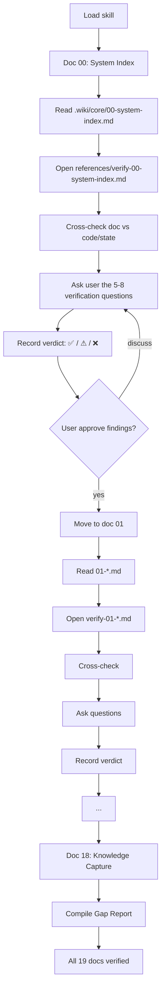

# wiki-assessment

This skill audits an existing project's documentation library by walking through each of the 19 core wiki docs **one at a time** and asking the user 5–8 targeted verification questions per doc to surface drift, gaps, and stale content.

> **CRITICAL**
> **The wiki is the brain of the app.** Every AI coding agent reads it before making decisions. A wiki that has drifted from the code is a wiki that lies to the next agent. Verification is cheaper than rework — a 5-minute audit prevents a 5-hour bug hunt.

This skill exists to surface what's wrong, in order, so it can be fixed.

---

## 1. Core Philosophy

| Principle | Meaning |
| :--- | :--- |
| **Drift is dangerous** | A doc that was true 6 months ago and isn't true now is worse than no doc. |
| **Per-Doc Attention** | Each of the 19 core docs gets a deliberate pass. No bulk "looks fine." |
| **Never silently fix** | Audit findings go to the user. The user decides what to fix and when. |
| **Gap → Report → Fix** | Surface gaps as a structured report; remediation is a separate, user-driven step. |

---

## 2. The Verification Loop (Core Workflow)

This is the **only** way this skill operates. Do not skim. Do not batch.



### For each of the 19 core docs (`00` → `18`):

1. **Read the doc** at `.wiki/core/0X-name.md`.
2. **Open the verification set** at `references/verify-0X-name.md` for the current slot.
3. **Cross-check the doc against reality** — code, configs, state, recent commits. Use `grep`, `ls`, and `read` to verify.
4. **Ask the user** the 5–8 verification questions. These are "does it match" questions, not "what is" questions. The agent is the one gathering evidence; the user confirms interpretation.
5. **Record a verdict** for the doc:
   - ✅ **Accurate** — doc matches reality.
   - ⚠ **Drift** — doc is partially correct but has stale or incomplete content.
   - ❌ **Missing or wrong** — doc is absent, contradicts reality, or has major gaps.
6. **Checkpoint with the user** before moving to the next doc. Confirm the verdict and the specific findings.
7. **Repeat** for the next slot in `00` → `18` order.

> **DO NOT** silently fix the doc. That's a separate workflow (use `wiki-bootstrap` to re-elicit content for drifted slots).
>
> **DO NOT** mark a doc as ✅ without actually checking. "Looks fine" is not verification.
>
> **DO** record specific evidence (file paths, commit hashes, configuration values) for any ⚠ or ❌ verdict.

---

## 3. Verification Set Reference Table

When you reach slot `0X`, open this file to read its verification question set:

| Slot | Doc | Verification Set |
| :--- | :--- | :--- |
| 00 | System Index (The Hub) | `references/verify-00-system-index.md` |
| 01 | Vision & North Star | `references/verify-01-vision-north-star.md` |
| 02 | Product Context | `references/verify-02-product-context.md` |
| 03 | Glossary of Terms | `references/verify-03-glossary-of-terms.md` |
| 04 | State & Context | `references/verify-04-state-context.md` |
| 05 | Core Architecture | `references/verify-05-core-architecture.md` |
| 06 | Directory Structure | `references/verify-06-directory-structure.md` |
| 07 | App Structure | `references/verify-07-app-structure.md` |
| 08 | User Journey | `references/verify-08-user-journey.md` |
| 09 | Design System | `references/verify-09-design-system.md` |
| 10 | Validation Standards | `references/verify-10-validation-standards.md` |
| 11 | Utility Standards | `references/verify-11-utility-standards.md` |
| 12 | Security Standards | `references/verify-12-security-standards.md` |
| 13 | Performance Standards | `references/verify-13-performance-standards.md` |
| 14 | Testing Standards | `references/verify-14-testing-standards.md` |
| 15 | AI Features | `references/verify-15-ai-features.md` |
| 16 | External Integrations | `references/verify-16-external-integrations.md` |
| 17 | Docs Blueprint | `references/verify-17-docs-blueprint.md` |
| 18 | Knowledge Capture | `references/verify-18-knowledge-capture.md` |

Each verification file follows this shape:

- **Why this doc matters to AI agents** — what decisions the next agent will make from this doc.
- **Required sections (sanity check)** — the must-have structure for the doc.
- **Questions to ask** — 5–8 "does it match" questions, in order.
- **What to verify against** — code paths, configs, or external systems to cross-check.

---

## 4. The Gap Report (Final Output)

After walking all 19 docs, compile a single structured report. The user uses this to prioritize remediation.

```markdown
# Wiki Gap Report — [YYYY-MM-DD]

## Summary
- ✅ Accurate: <count>
- ⚠ Drift: <count>
- ❌ Missing/Wrong: <count>

## Findings by Slot

### 00 — System Index
- Verdict: ✅ / ⚠ / ❌
- Evidence: <file paths, commit hashes, config values>
- Specific drift/gap: <description>
- Suggested fix: <re-elicit via wiki-bootstrap, or specific edit>

### 01 — Vision & North Star
- Verdict: …
- …
(continue for all 19 slots)

## Prioritized Remediation
1. (Critical) Doc 13 — Security Standards: documented RLS doesn't match firestore.rules
2. (High) Doc 07 — State Context: useAuth() signature drifted; return shape missing logout()
3. (Medium) Doc 04 — Directory Structure: new `src/hooks/` not documented
4. (Low) Doc 16 — Glossary: term "scope" used in code but not defined here
```

The agent **does not** apply the fixes. The user reviews the report and decides what to act on. Once a fix is approved, the agent can either run `wiki-bootstrap` on the affected slot (re-elicit content from scratch) or make targeted edits per the user's direction.

---

## 5. Lifecycle Operations (YAML & Index Syncing)

When remediating audit findings (either as part of the audit or as a follow-up), apply these rules:

### A. Progressive Version Control (YAML)
Every created or modified file must update its YAML frontmatter. Mark superseded docs with `status: "deprecated"` or move them to a `deprecated/` subfolder.

### B. Table of Contents Syncing
When adding or deleting files, update the corresponding category index:

- `.wiki/features/features-index.md`
- `.wiki/components/components-index.md`
- `.wiki/database/database-index.md`
- `.wiki/logic/logic-index.md`
- `.devops/backlog/backlog-index.md` (operational)

### C. Project Audit Logging (The Wrap-Up Protocol)
Whenever an audit is complete or a finding is remediated, append a chronological entry to `.devops/logs/agent-changelog.md` using this exact format:

```markdown
## [YYYY-MM-DD HH:MM] — <Task/Feature Name>
**Agent:** <Agent Name>
**Files Modified:**
- `src/...`
- `.wiki/...`
**Database Changes:** None (or list migrations)
**Summary:** <One-sentence summary>
```

---

## 6. Quick Triage Pre-Scan (Optional, Before the Loop)

Before walking the 19 docs in order, you may optionally read `.devops/logs/agent-changelog.md` to surface recently modified features. Use this to **prioritize** which slots to scrutinize first — it is **not** a substitute for the full per-doc loop. The full walk is always required regardless of what the changelog reveals.

---

## 7. When to Use This Skill

- **Routine audits** — quarterly, or after a major feature ships.
- **Pre-deployment vibes check** — paired with `pre-deployment-vibe-auditor` to catch doc drift before it ships.
- **Suspected drift** — user says "the wiki feels stale" or "this code doesn't match what the doc says."
- **Onboarding a new project** — when handed an unfamiliar codebase, use this to surface what's known vs. what's missing before making changes.

For bootstrapping a new wiki from scratch, use the companion skill: **`wiki-bootstrap`**.

---

> **The Golden Rule**
> If a feature's behavior changes in code, the documentation **MUST** be updated in the same PR/Conversation. Outdated documentation is technical debt that misleads every AI agent that reads it next.
