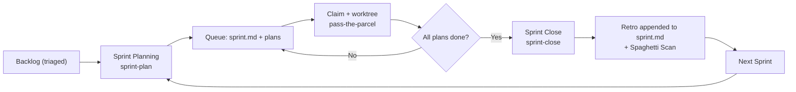

<!--
type: template
version: 3
updated: 2026-09-13

SPRINTS.template.md — seed for a satellite's sprint register.
Copy to .devops/backlog/SPRINTS.md and fill the Sprint Index from your triaged backlog.
The @sprint-plan / @sprint-status / @sprint-close skills read and write this file.
A sprint is a time-boxed container of parcel plans drawn from the triaged backlog,
closed by a retrospective + spaghetti scan. The sprint's own record is a single
sprint.md; there is no separate retro.md.
-->
---
type: "process"
name: "Sprint Register"
status: "active"
description: "Index of all sprints. A sprint is a time-boxed container of parcel plans drawn from the triaged backlog, closed by a retrospective + spaghetti scan."
last_sprint: "none"
---
# 🏃 {Project} — Sprint Register

> **What this is:** The index of development sprints. Each sprint groups a batch of parcel plans into one focused cycle with a shared goal, then closes with a retro and code-quality scan. This is the rhythm that keeps development clean, directed, and hygienic.

---

## The Sprint Cycle

| Phase | Skill | Output | When |
|-------|-------|--------|------|
| **Plan** | `@sprint-plan` | `.devops/sprints/sprint-{n}-<slug>/sprint.md` + sprint plan queue + SPRINTS.md row | Start of cycle |
| **Claim & Execute** | `@pass-the-parcel` (per plan) | Plan claimed → `.devops/plans/` → COMPLETE → `.devops/archive/` | During cycle |
| **Batch Run** | `@sprint-run` | Every eligible queued plan run Phases 1–9 in one pass, each claimed on the trunk and left at `PHASE_9` Gate D `OPEN` → one consolidated Gate D report | During cycle (optional, unattended) |
| **Close** | `@sprint-close` | Retro appended to `sprint.md`; `sprint.md` archived to `.devops/archive/sprints/`; REFACTORING.md update | End of cycle |
| **Status** | `@sprint-status` | Burn-up readout, no file writes | Anytime mid-cycle |

---

## Sprint Structure

Each sprint lives in `.devops/sprints/sprint-{n}-<slug>/`:

| File | Purpose |
|------|---------|
| `sprint.md` | Single record: goal, capacity, committed scope (queue), out-of-scope, open/close state, retro |
| `<code>-<slug>-plan.md` | Committed-but-unclaimed plans — the **queue**. A claim moves one to `.devops/plans/`. |

On completion a plan moves straight to `.devops/archive/` (root) and is linked back to the sprint by its `sprint:` front-matter field. At close, only `sprint.md` moves to `.devops/archive/sprints/sprint-{n}-<slug>/`. The canonical templates are embedded in the `@sprint-plan` / `@sprint-close` skills and seeded at `.devops/templates/sprint.template.md`.

---

## How Scope Flows In

A sprint draws its plans from three sources, in priority order:

1. **🔴 NOW / 🟡 NEXT items** from [backlog-index.md](./backlog-index.md) Triage Panel — feature work, bugs, deadlines.
2. **Carry-forward** — unfinished plans from the previous sprint's retro.
3. **Kill List top-N** from [REFACTORING.md](./REFACTORING.md) — *only* if the sprint has spare capacity or is designated a stabilisation sprint.

Refactoring does NOT drive a normal sprint. It rides along when there's room, or gets its own dedicated stabilisation sprint. See [TRIAGE.md § Refactoring Trigger](./TRIAGE.md#refactoring-trigger).

---

## Capacity Model

Sprints are sized by **effort points**, not hours (hours lie; relative size doesn't). Map each plan's effort to a point value:

| Size | Points | Typical |
|------|--------|---------|
| S | 1 | Single-session fix, drop a table, bump a dep |
| M | 3 | One focused parcel — schema + code + tests |
| L | 5 | Multi-file decomposition, new pillar slice |
| XL | 8+ | Epic-level — usually split before committing |

A sprint commits to a **capacity budget** (start conservative, calibrate from retros). If a plan turns out bigger than estimated, it carries forward rather than blowing up the sprint.

---

## Sprint Index

| # | Name | Goal | Status | Sprint | Retro |
|---|------|------|--------|--------|-------|
| — | *(no sprints yet)* | Run `@sprint-plan` to open the first one | — | — | — |

---

## Conventions

- **Numbering:** Sequential integers (`sprint-1`, `sprint-2`…). No skipping. The integer is the tooling key; the slug is the human theme — `sprint-{n}-<slug>`.
- **Single record:** One `sprint.md` per sprint; the retrospective is appended to it at close (no `retro.md`).
- **One active sprint at a time.** You don't open sprint N+1 until sprint N is closed.
- **Stable code is the link.** A plan keeps its `T{theme}-E{epic}.{impl}` code for life; physical moves (backlog → sprint queue → plans → archive) are signals, and the `sprint:` front-matter field links a shipped plan back to its sprint.
- **Claim before execution.** Only one claim may cover a given file — see [`.devops/rules/plan-lifecycle.md`](../rules/plan-lifecycle.md) § Claim Protocol.
- **Completed sprints are archived** to `.devops/archive/sprints/sprint-{n}-<slug>/` at close, so the retro history is a continuous record of how the project was run.
