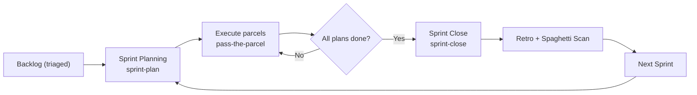

<!--
type: template
version: 1
updated: 2026-09-09

SPRINTS.template.md — seed for a satellite's sprint register.
Copy to .devops/backlog/SPRINTS.md and fill the Sprint Index from your triaged backlog.
The @sprint-plan / @sprint-status / @sprint-close skills read and write this file.
-->
---
type: "process"
name: "Sprint Register"
status: "active"
description: "Index of all sprints. A sprint is a time-boxed container of parcel plans drawn from the triaged backlog, closed by a retrospective + spaghetti scan."
last_sprint: "none"
---
# 🏃 {Project} — Sprint Register

> **What this is:** The index of development sprints. Each sprint groups a batch of parcel plans into one focused cycle with a shared goal, then closes with a retro and code-quality scan. This is the rhythm that keeps development clean, directed, and hygienic.

---

## The Sprint Cycle

| Phase | Skill | Output | When |
|-------|-------|--------|------|
| **Plan** | `@sprint-plan` | `sprints/sprint-{n}/plan.md` + SPRINTS.md row | Start of cycle |
| **Execute** | `@pass-the-parcel` (per plan) | Completed parcel plans → archive | During cycle |
| **Close** | `@sprint-close` | `sprints/sprint-{n}/retro.md` + REFACTORING.md update | End of cycle |
| **Status** | `@sprint-status` | Burn-up readout, no file writes | Anytime mid-cycle |

---

## Sprint Structure

Each sprint lives in `.devops/backlog/sprints/sprint-{n}/`:

| File | Purpose |
|------|---------|
| `plan.md` | Committed scope, goal, capacity, out-of-scope list |
| `retro.md` | What shipped, metrics before→after, lessons, carry-forward |

The canonical templates are embedded in the `@sprint-plan` and `@sprint-close` skills.

---

## How Scope Flows In

A sprint draws its plans from three sources, in priority order:

1. **🔴 NOW / 🟡 NEXT items** from [backlog-index.md](./backlog-index.md) Triage Panel — feature work, bugs, deadlines.
2. **Carry-forward** — unfinished plans from the previous sprint's retro.
3. **Kill List top-N** from [REFACTORING.md](./REFACTORING.md) — *only* if the sprint has spare capacity or is designated a stabilisation sprint.

Refactoring does NOT drive a normal sprint. It rides along when there's room, or gets its own dedicated stabilisation sprint. See [TRIAGE.md § Refactoring Trigger](./TRIAGE.md#refactoring-trigger).

---

## Capacity Model

Sprints are sized by **effort points**, not hours (hours lie; relative size doesn't). Map each plan's effort to a point value:

| Size | Points | Typical |
|------|--------|---------|
| S | 1 | Single-session fix, drop a table, bump a dep |
| M | 3 | One focused parcel — schema + code + tests |
| L | 5 | Multi-file decomposition, new pillar slice |
| XL | 8+ | Epic-level — usually split before committing |

A sprint commits to a **capacity budget** (start conservative, calibrate from retros). If a plan turns out bigger than estimated, it carries forward rather than blowing up the sprint.

---

## Sprint Index

| # | Name | Goal | Plans | Status | Retro |
|---|------|------|-------|--------|-------|
| — | *(no sprints yet)* | Run `@sprint-plan` to open the first one | — | — | — |

---

## Conventions

- **Numbering:** Sequential integers (`sprint-1`, `sprint-2`…). No skipping.
- **Naming:** Short human name capturing the theme.
- **One active sprint at a time.** You don't open sprint N+1 until sprint N's retro is written.
- **Plans stay independent.** A sprint references parcel plans by code; it does not absorb them. A plan can be carried from one sprint to the next without editing the plan itself — only the sprint's `plan.md`/`retro.md` change.
- **Completed sprints stay in place** (don't archive the folder) so the retro history is a continuous record of how the project was run.
