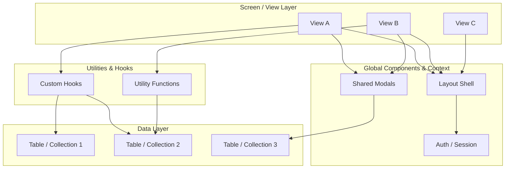

---
type: "core"
name: "System Index"
status: "stable"
dependencies: []
db_relations: []
description: "Master gateway - the hub in a hub-and-spoke documentation architecture"
---

# System Index (Developer Onboarding Hub)

This document is the **hub** in a hub-and-spoke architecture (see [9 Hub & Spoke Pattern](#9-hub--spoke-pattern)). It links to the major category index docs - those index docs are the authoritative catalogs for their domains.

## Quick Reference - Core Docs

| Slot | Doc | Theme | Description |
|---|---|---|---|
| 00 | System Index | Hub | The hub - master gateway, architecture flow, doc index |
| 01 | Vision & North Star | Strategy | Strategic vision, North Star metric, anti-goals |
| 02 | Product Context | Strategy | User personas, use cases, data hierarchy, roadmap |
| 03 | Glossary of Terms | Strategy | Domain terms, data hierarchy, abbreviations |
| 04 | State & Context | Architecture | State management, context shapes, data flow |
| 05 | Core Architecture | Architecture | Architecture decisions, guardrails, core patterns |
| 06 | Directory Structure | Architecture | Source tree, folder purposes, file naming |
| 07 | App Structure | Architecture | Application shell, router, context providers |
| 08 | User Journey | Workflow | End-to-end workflow, user roles, phases |
| 09 | Design System | Design | Color tokens, typography, components, interaction states |
| 10 | Validation Standards | Standards | Field/entity validation, data integrity rules |
| 11 | Utility Standards | Standards | Rounding rules, formatting, decimal protocol |
| 12 | Security Standards | Standards | Security perimeter, RLS, auth, dependency mgmt |
| 13 | Performance Standards | Standards | Bundle budgets, lazy-loading, render optimization |
| 14 | Testing Standards | Standards | Test patterns, mocking, performance budgets |
| 15 | AI Features | Features | AI workflows, model integration, prompt architecture |
| 16 | External Integrations | Features | Third-party API integrations, import/export mappings |
| 17 | Docs Blueprint | Meta | Documentation standards, naming, folder taxonomy |
| 18 | Knowledge Capture | Meta | Architectural decisions, tribal knowledge, decision log |

## 1. Strategy - Vision, Context & Vocabulary
- [Vision & North Star](./01-vision-north-star.md) - Strategic vision, North Star metric, anti-goals
- [Product Context & Strategy](./02-product-context.md) - User personas, use cases, data hierarchy, roadmap
- [Glossary of Terms](./03-glossary-of-terms.md) - Domain terminology, abbreviations, data hierarchy reference

## 2. Architecture - Structure, State & Data Flow
- [State & Context Data Shapes](./04-state-context.md) - Context shapes, store structures, data models
- [Core Architecture Concepts](./05-core-architecture.md) - Architecture decisions, guardrails, core patterns
- [Physical Directory Structure](./06-directory-structure.md) - Source file tree, folder purposes, naming rules
- [App Shell Structure](./07-app-structure.md) - Entry point, provider tree, router, layout boundaries

## 3. Workflow - The User Journey
- [User Journey & Data Hierarchy](./08-user-journey.md) - End-to-end workflow, user roles, phases

## 4. Design - Visual Language
- [UI/UX Design System](./09-design-system.md) - Color tokens, typography, components, interaction states

## 5. Standards - Engineering Guardrails
- [Validation Standards](./10-validation-standards.md) - Field/entity validation, integrity rules
- [Utility Standards](./11-utility-standards.md) - Rounding, formatting, decimal protocol
- [Security Standards](./12-security-standards.md) - Security perimeter, RLS, auth
- [Performance Standards](./13-performance-standards.md) - Bundle budgets, lazy-loading, optimization
- [Testing Standards](./14-testing-standards.md) - Test patterns, mocking, performance budgets

## 6. Features - Specialized Capabilities
- [AI Features & Workflows](./15-ai-features.md) - AI workflows, model integration
- [External Integrations](./16-external-integrations.md) - Third-party APIs, import/export

## 7. Meta - Docs & Knowledge
- [Docs Blueprint](./17-docs-blueprint.md) - Documentation standards, naming, folder taxonomy
- [Knowledge Capture & Decisions](./18-knowledge-capture.md) - Architectural decisions, tribal knowledge

## 8. External References
- [Agent Changelog](../../../.devops/logs/agent-changelog.md)
- [Version History](../../../.devops/logs/version-history.md)
- [Knowledge Changelog](../../../.devops/logs/knowledge-changelog.md)
- [Naming Conventions Index](../conventions/conventions-index.md) - Hub for all naming conventions
- [Testing Index](../testing/testing-index.md) - Test architecture docs

## 9. Component & View Code
- [Components Index](../components/components-index.md) - Catalog of all UI components
- [Features Index](../features/features-index.md) - Catalog of all views/screens

## 10. Visual Architecture Flow

This diagram represents the general data flow pattern from views to data layer:



## 11. Core Logic & Utilities
- [Logic & Utilities Index](../logic/logic-index.md) - Catalog of all utilities, hooks, and config

## 12. Database Schema Signatures
- [Database Index](../database/database-index.md) - Catalog of all schema docs with relationship map

## 13. Operational Docs
- [Implementation Plans Index](../../../.devops/plans/)
- [Agent Changelog](../../../.devops/logs/agent-changelog.md)
- [Version History](../../../.devops/logs/version-history.md)

## 14. Hub & Spoke Pattern

This wiki follows a **hub-and-spoke** architecture:

```
00-system-index.md  <- The Hub (this file - master gateway)
  +-- components/components-index.md   <- Spoke: catalogs all ui-* docs
  +-- features/features-index.md       <- Spoke: catalogs all feat-* docs
  +-- database/database-index.md       <- Spoke: catalogs all db-* docs
  +-- logic/logic-index.md             <- Spoke: catalogs all util-* and hook-* docs
  +-- conventions/conventions-index.md <- Spoke: catalogs all conv-* docs
  +-- testing/testing-index.md         <- Spoke: catalogs all testing docs
```

**How it works:**
- `00-system-index.md` provides the 10,000-foot view - core docs, architecture flow, and one link per category
- Each category index is the **authoritative catalog** for its domain
- Individual docs link directly to their dependencies using relative paths

**Maintenance rule:** When adding a new doc, update the relevant category index. Only update `00-system-index.md` if adding a new category or a new core doc (slots 01-18).

## See Also
- [17-docs-blueprint.md](./17-docs-blueprint.md) - Documentation standards and taxonomy
- [18-knowledge-capture.md](./18-knowledge-capture.md) - Knowledge capture and decisions
