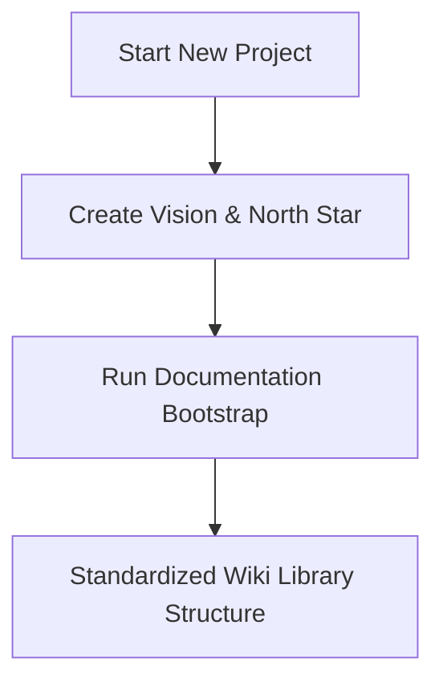
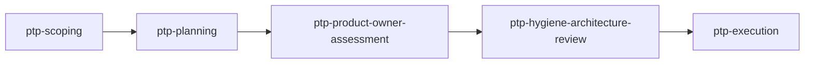
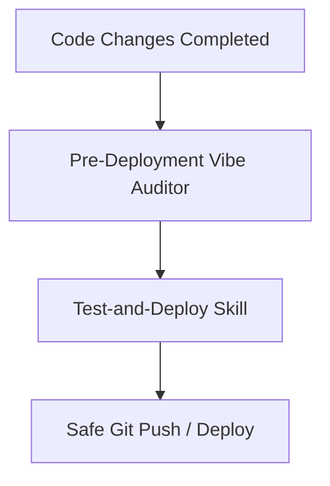

# How-To: Agentic Development & Documentation Lifecycle

Welcome to this base-agnostic template library. This guide details the logical workflow and methodologies for building apps and managing documentation using the agentic skills provided in this workspace.

---

## 1. Bootstrapping & Core Setup

Every new project starts with aligning on the product context and establishing a solid, standardized documentation base.

### Phase A: Vision & North Star
*   **Skill:** `create-app-vision-north-star`
*   **Purpose:** Synthesizes the codebase and requirements into an actionable, high-level strategic roadmap (`01-vision-north-star.md`). It aligns product objectives with engineering tasks and establishes constraints.

### Phase B: Documentation Bootstrap
*   **Skill:** `documentation-architecture-bootstrap` or `wiki-bootstrap`
*   **Purpose:** Initializes a standardized folder structure under `wiki/` (core contexts, architectural logs, and indices) to serve as the single source of truth for the agent.

---

## 2. Dual Agent Development Methodologies

Depending on the task's complexity, team style, or token optimization constraints, you can choose or combine two primary agentic coding patterns:

### Method A: Pass the Parcel (Stateless / Planning Mode)
*   **Skill:** `pass-the-parcel`
*   **Execution:** Highly token-efficient and modular. A single markdown plan file (`dev/plans/...`) acts as the state carrier. Agents pass the file "parcel" to the next step, ensuring clean context boundaries.

### Method B: The Multi-Stage Code Pipeline
For deeply structured, robust feature implementation, use the sequential pipeline of specialized agent personas:

1.  **`ptp-scoping`**: Group A (Phases 1-3) — expands intent, runs Context Inventory (wiki docs + knowledge capture + source), resolves all ambiguity via interactive Phase 3 questioning, halts at Gate A.
2.  **`ptp-planning`**: Group B (Phase 4) — reads scoped plan at Gate A, produces detailed file-level execution plan via Simplicity Ladder, halts at Gate B.
3.  **`ptp-product-owner-assessment`**: Phase 5 — audits plan for vision alignment, business logic, edge cases, and functional risk; syncs decisions to knowledge capture.
4.  **`ptp-hygiene-architecture-review`**: Phase 6 — hardens plan with DRY scan, secret mgmt, RLS, rate limiting, error handling, zero-knowledge instruction density.
5.  **`ptp-execution`**: Group D (Phases 7-8) — executes hardened plan exactly as written, runs QA verification, halts at Gate D for user sign-off.

---

## 3. Knowledge Retention & Wrap-Up

As implementation concludes, the agent must document what it learned and clean up the workspace logs.

*   **Agent Log (`AGENT.md`)**: A running chronological journal of the agent's work, current objectives, and state.
*   **`knowledge-consolidation` (Knowledge Capture)**: Periodically structures, de-duplicates, and archives local developer knowledge into indexed snippets.
*   **`agent-wrap-up`**: Runs final workspace state synchronization. It reviews modified files, writes the walkthrough (`walkthrough.md`), updates logs, and closes the active loop.

---

## 4. Pre-Deployment Validation

Before any code is pushed to production or committed to the remote repository, it must pass a strict security and quality gateway:

*   **`pre-deployment-vibe-auditor`**: Scans the codebase for "vibe-coded" anomalies, architectural drift, unoptimized queries, missing error handling, or security risks.
*   **`Test-and-Deploy`**: Automates running the local test suite, executing linter rules, and verifying configurations before executing a safe, pre-validated git push or deployment.

---

This framework ensures that any app built on top of this scaffold remains clean, well-documented, and safe to deploy.
