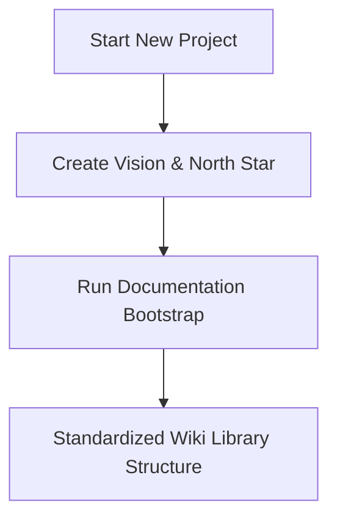
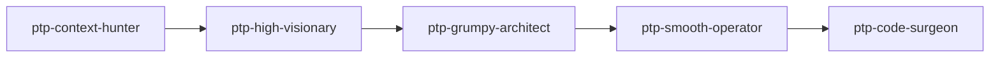
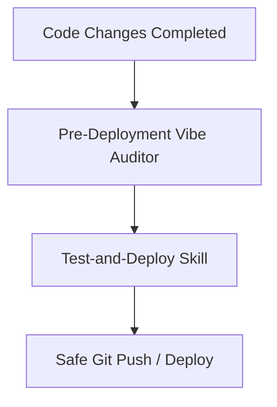

# How-To: Agentic Development & Documentation Lifecycle

Welcome to this base-agnostic template library. This guide details the logical workflow and methodologies for building apps and managing documentation using the agentic skills provided in this workspace.

---

## 1. Bootstrapping & Core Setup

Every new project starts with aligning on the product context and establishing a solid, standardized documentation base.



### Phase A: Vision & North Star
*   **Skill:** `@app-vision-north-star`
*   **Purpose:** Synthesizes the codebase and requirements into an actionable, high-level strategic roadmap (`01-vision-north-star.md`). It aligns product objectives with engineering tasks and establishes constraints.

### Phase B: Documentation Bootstrap
*   **Skill:** `@wiki-bootstrap`
*   **Purpose:** Initializes a standardized folder structure under `.wiki/` (core contexts, architectural logs, and indices) to serve as the single source of truth for the agent.

---

## 2. Dual Agent Development Methodologies

Depending on the task's complexity, team style, or token optimization constraints, you can choose or combine two primary agentic coding patterns:

### Method A: Pass the Parcel (Stateless / Planning Mode)
*   **Skill:** `@pass-the-parcel`
*   **Execution:** Highly token-efficient and modular. A single markdown plan file (`.devops/plans/...`) acts as the state carrier. Agents pass the file "parcel" to the next step, ensuring clean context boundaries.

### Method B: The Multi-Stage Code Pipeline
For deeply structured, robust feature implementation, use the sequential pipeline of specialized agent personas:



1.  **`ptp-context-hunter`**: Group A (Phases 1-3) — expands intent, runs Context Inventory (wiki docs + knowledge capture + source), resolves all ambiguity via interactive Phase 3 questioning, halts at Gate A.
2.  **`ptp-high-visionary`**: Group B (Phase 4) — reads scoped plan at Gate A, produces standard implementation plan via Simplicity Ladder (no code snippets unless necessary), halts at Gate B. Handles `PHASE_4_REVISION` fix rounds when a review fails.
3.  **`ptp-grumpy-architect`**: Phase 5 — **Spec & Logic Audit** of the text-based architecture (the plan contains no code). Evaluates logical completeness, edge cases, file boundary collisions, dependency gaps, YAGNI bloat, performance trade-offs, security, and architectural anti-patterns. Rejection sets `PHASE_4_REVISION`.
4.  **`ptp-smooth-operator`**: Phase 6 — audits plan for vision alignment, business logic, edge cases, and functional risk; syncs decisions to knowledge capture.
5.  **`ptp-code-surgeon`**: Group D (Phases 7-8) — **triggers only after Gate C is cleared by explicit user input**. Executes the approved spec with single-pass direct-to-disk writing (no intermediate Markdown code blocks), runs QA verification, halts at Gate D for user sign-off.

**Deterministic Rejection Loop (Gate C):** If Phase 5 or 6 fails review, the plan's status is set to `PHASE_4_REVISION` and returned to Group B (High-Visionary) for fixes before re-evaluating Gate C. **An unapproved plan never advances to execution.**

### Mode Selection
Plans support two operational modes:
- **`USER-MANAGED`** *(Recommended)* — the orchestrator halts at every gate (A, B, C, D) for explicit user approval.
- **`AUTO`** — gates auto-advance without user interaction. Hard halts still fire for destructive actions, build failures, and unresolvable blockers.

---

## 3. Knowledge Retention & Wrap-Up

As implementation concludes, the agent must document what it learned and clean up the workspace logs.

*   **Agent Changelog** (`.devops/logs/agent-changelog.md`): A running chronological journal of agent actions, changes, and state.
*   **Knowledge Changelog** (`.devops/logs/knowledge-changelog.md`): Tracks wiki health scan results and link integrity reports.
*   **`@knowledge-consolidation`**: Periodically structures, de-duplicates, and archives local developer knowledge into indexed snippets.
*   **`@agent-wrap-up`**: Runs final workspace state synchronization. It reviews modified files, updates logs, archives the plan, and closes the active loop.
*   **`@spaghetti-monster`**: Scans for high-complexity code regions and packages them into backlog parcel plans for later refactoring.

---

## 4. Pre-Deployment Validation

Before any code is pushed to production or committed to the remote repository, it must pass a strict security and quality gateway:



*   **`@pre-deployment-vibe-auditor`**: Scans the codebase for "vibe-coded" anomalies, architectural drift, unoptimized queries, missing error handling, or security risks.
*   **`@test-and-deploy`**: Automates running the local test suite, executing linter rules, and verifying configurations before executing a safe, pre-validated git push or deployment.

---

## 5. Additional Utility Skills

| Skill | Purpose |
|---|---|
| `@wiki-query` | Read-only lookup and synthesis from wiki docs |
| `@wiki-lint` | Check wiki health, detect broken links, index drift |
| `@design-audit` | Audit UI compliance against design system |
| `@karpathy-guidelines` | Code writing and review best practices |
| `@backlog` | Create and manage backlog items |
| `@knowledge-capture` | Record tribal knowledge and decisions |
| `@skill-creator` | Create and iterate on new agent skills |
| `@true-or-false` | Validate requirements against codebase reality |
| `@ui-inventory-scanner` | Scan and catalogue UI elements |
| `@build-roadmap` | Create product roadmap with themes and epics |
| `@frontend-design` | Build production-grade frontend interfaces |
| `@sync-architecture` | Pull template machinery updates into a satellite workspace |

---

## 6. Syncing Machinery into a Satellite Workspace

This repo is the **template**; any other workspace is a **satellite** that consumes the portable
surface (`.devops/skills/`, `.devops/agents/`, rule layers, `.devops/templates/`, `.vscode/`, sync scripts).

**One-time bootstrap (push).** A satellite has no pull script yet, so first contact goes through
the template's push engine:

```powershell
powershell -NoProfile -File <template>\scripts\sync-architecture.ps1 -Target <satellite>
# or from git: clone to %TEMP%\ptp and run the same command from there
```

Then author the three repo-specific files from the seeds in `.devops/templates/`
(`AGENTS.md`, `opencode.json`, `.opencode/plans/base-context.md`) — see
`.devops/templates/SATELLITE-BOOTSTRAP.md` for the full checklist.

**Ongoing pulls.** Record the source once — `scripts\pull-architecture.ps1 -Source <path-or-git-url>`
writes `.ptp-source` — then just say "sync architecture" (`@sync-architecture`) or run
`scripts\pull-architecture.ps1`. Add `-Check` for a read-only drift report with per-item verdicts:

| Verdict | Meaning |
|---|---|
| `CURRENT` | identical |
| `UPGRADE` | newer version upstream — safe to pull |
| `DRIFT` | same version, different bytes — locally customized, diff before overwriting |
| `MISSING` | never installed here — a sync will create it |
| `SOURCE-ABSENT` | manifest lists it but the template lacks it — manifest bug |

**Versioning.** Each skill carries an integer `version:` + `updated:` date in its frontmatter;
`.devops/sync-manifest.yaml` carries one `machinery-version:` covering agents/rules/scripts/
templates as a coordinated set. The `@agent-wrap-up` skill owns the bump discipline: modify a
portable file → bump its version (and `machinery-version` for non-skill surfaces) → satellites
see `UPGRADE`, not `DRIFT`.

**Model binding.** The parcel pipeline routes by capability slot — `planning`, `review-heavy`,
`execution` — never by vendor model name. Machinery docs (base-context, skills, agents) describe
slots only; each satellite binds slots to concrete models in its own `opencode.json`
(`agent.<name>.model`). Swapping providers is a config edit, not a machinery sync. CI
(`.github/workflows/validate.yml`) enforces the prefix, encoding, wiki, JSON, and coverage gates
on every push; `scripts/sync-architecture.ps1 -SelfTest` smoke-tests the transport engine itself.

This framework ensures that any app built on top of this scaffold remains clean, well-documented, and safe to deploy.
