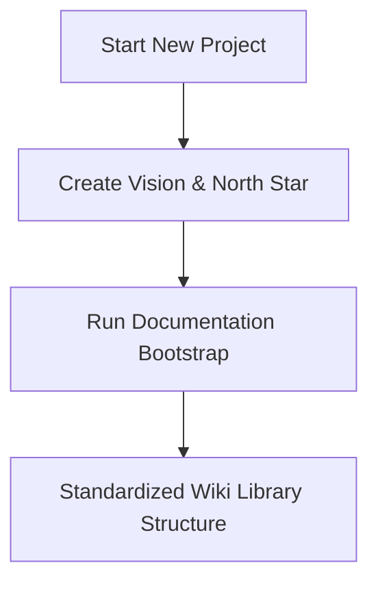
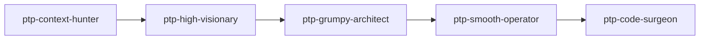
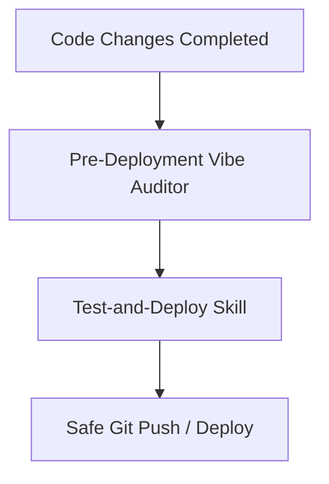

# How-To: Agentic Development & Documentation Lifecycle

Welcome to **Pass the Parcel** — a base-agnostic template library. This guide details the logical workflow and methodologies for building apps and managing documentation using the agentic skills provided in this workspace.

---

## 1. Bootstrapping & Core Setup

Every new project starts with aligning on the product context and establishing a solid, standardized documentation base.



### Phase A: Vision & North Star
*   **Skill:** `@app-vision-north-star`
*   **Purpose:** Synthesizes the codebase and requirements into an actionable, high-level strategic roadmap (`01-vision-north-star.md`). It aligns product objectives with engineering tasks and establishes constraints.

### Phase B: Documentation Bootstrap
*   **Skill:** `@wiki-bootstrap`
*   **Purpose:** Initializes a standardized folder structure under `.wiki/` (core contexts, architectural logs, and indices) to serve as the single source of truth for the agent.

---

## 2. The Parcel Pipeline

Every multi-step task runs through the same stateless parcel pipeline: a single markdown plan file (`.devops/plans/[slug]-plan.md`) carries all state. In the default `MULTI` topology each phase group is executed by one specialized sub-agent that reads the plan, does its job, updates the plan, and exits; in `SINGLE` topology (fast plan) the orchestrator plays those personas inline — see [§ Agent Topology](#agent-topology).



1.  **`ptp-context-hunter`** — Group A (Phases 1-3): expands intent, runs the Context Inventory (wiki docs + knowledge capture + source), resolves ambiguity via interactive Phase 3 questioning, halts at Gate A.
2.  **`ptp-phase3-answerer`** — Phase 3.5 (`AUTO` mode only): auto-resolves Phase 3 questions from the Research Map; any `Unresolvable:` entry falls back to asking the user.
3.  **`ptp-high-visionary`** — Group B (Phases 4-5): writes the wiki requirements spec + acceptance criteria, then the implementation plan (Simplicity Ladder; no code snippets except exact string literals), halts at Gate B. Also owns `PHASE_5_REVISION` fix rounds.
4.  **`ptp-grumpy-architect`** — Phase 6: **Spec & Logic Audit** of the text-based architecture (the plan contains no code). Evaluates logical completeness, edge cases, file boundary collisions, dependency gaps, YAGNI bloat, performance trade-offs, security, and architectural anti-patterns. Rejection sets `PHASE_5_REVISION`.
5.  **`ptp-smooth-operator`** — Phase 7: product review of vision alignment, user journey, and scope containment. Rejection sets `PHASE_5_REVISION`.
6.  **`ptp-code-surgeon`** — Group D (Phases 8-9): **triggers only after the plan is approved** (Gate C in `MULTI`; Gate B in `SINGLE`). Executes the approved plan single-pass direct-to-disk (no intermediate Markdown code blocks), runs QA verification, halts at Gate D for user sign-off.

**Deterministic rejection loop (Gate C):** if Phase 6 or 7 fails review, the plan's status is set to `PHASE_5_REVISION` and returned to Group B (High-Visionary) before Gate C is re-evaluated. **An unapproved plan never advances to execution.**

**Gates:** A (Scope, after Phase 3) → B (Spec & Plan, after Phase 5) → C (Peer Reviews, after Phase 7) → D (Implementation, after Phase 9). The lifecycle states are canonical in the `@pass-the-parcel` skill.

### Mode Selection
Plans support two operational modes:
- **`USER-MANAGED`** *(default)* — the orchestrator halts at every gate (A, B, C, D) for explicit user approval.
- **`AUTO`** — Gates A-C auto-clear after mechanical verification; **Gate D always halts for the human**. Hard halts still fire for destructive actions, build failures, and unresolvable blockers.

### Agent Topology
Independently of the mode, a plan runs in one of two topologies — chosen by **task complexity** (blast radius, contract change, risk, ambiguity, novelty) and confirmed by the user at plan start:
- **`MULTI`** *(default — comprehensive plan)* — the orchestrator delegates each phase group to its `ptp-*` sub-agent; Group C runs as independent, context-isolated reviewers; 4 gates (A-D).
- **`SINGLE`** *(fast plan)* — the orchestrator executes each group's persona inline (no sub-agent spawns); Group C is skipped and Gates B+C merge into one approval at Gate B (Gate C `N/A`); cheapest for local, low-risk changes.

Gate A and Gate D always halt for the human in both topologies. Record the choice in the plan's **State & Gates** `Agents` row. Full contract: `@pass-the-parcel` § Agent Topology.

---

## 3. Knowledge Retention & Wrap-Up

As implementation concludes, the agent must document what it learned and clean up the workspace logs.

*   **Agent Changelog** (`.devops/logs/agent-changelog.md`): A running chronological journal of agent actions, changes, and state.
*   **`@knowledge-consolidation`**: Periodically structures, de-duplicates, and archives local developer knowledge into indexed snippets.
*   **`@agent-wrap-up`**: Runs final workspace state synchronization. It reviews modified files, updates logs, archives the plan, and closes the active loop.
*   **`@spaghetti-monster`**: Scans for high-complexity code regions and packages them into backlog parcel plans for later refactoring.

---

## 4. Pre-Deployment Validation

Before any code is pushed to production or committed to the remote repository, it must pass a strict security and quality gateway:



*   **`@pre-deployment-vibe-auditor`**: Scans the codebase for "vibe-coded" anomalies, architectural drift, unoptimized queries, missing error handling, or security risks.
*   **`@test-and-deploy`**: Automates running the local test suite, executing linter rules, and verifying configurations before executing a safe, pre-validated git push or deployment.

---

## 5. Additional Utility Skills

| Skill | Purpose |
|---|---|
| `@wiki-query` | Read-only lookup and synthesis from wiki docs |
| `@wiki-lint` | Check wiki health, detect broken links, index drift |
| `@wiki-generate` | Draft index rows and doc skeletons from the codebase (structure) + ingest an `openwiki/` OKF bundle |
| `@wiki-update` | Refresh only the docs a `git diff` invalidated; stamp `last-reviewed` |
| `@wiki-bootstrap` | Verification pass over the wiki, one doc at a time (v2) |
| `@design-audit` | Audit UI compliance against design system |
| `@karpathy-guidelines` | Code writing and review best practices |
| `@backlog` | Create and manage backlog items |
| `@knowledge-capture` | Record tribal knowledge and decisions |
| `@skill-creator` | Create and iterate on new agent skills |
| `@true-or-false` | Validate requirements against codebase reality |
| `@ui-inventory-scanner` | Scan and catalogue UI elements |
| `@build-roadmap` | Create product roadmap with themes and epics |
| `@frontend-design` | Build production-grade frontend interfaces |
| `@sync-architecture` | Pull template machinery updates into a satellite workspace |

---

## 6. Syncing Machinery into a Satellite Workspace

This repo is the **template**; any other workspace is a **satellite** that consumes the portable
surface (`.devops/skills/`, `.devops/agents/`, rule layers, `.devops/templates/`, `.vscode/`, sync scripts).

**One-time bootstrap (push).** A satellite has no pull script yet, so first contact goes through
the template's push engine:

```powershell
powershell -NoProfile -File <template>\scripts\sync-architecture.ps1 -Target <satellite>
# or from git: clone to %TEMP%\ptp and run the same command from there
```

Then author the three repo-specific files from the seeds in `.devops/templates/`
(`AGENTS.md`, `opencode.json`, `.opencode/plans/base-context.md`) — see
`.devops/templates/SATELLITE-BOOTSTRAP.md` for the full checklist.

> **v20 migration (opencode.json).** If you previously deleted the `agent` block from
> `opencode.json` (the old seed told you to), that layout still validates —
> `check-parcel-prefix.ps1` prints `SKIP` rather than failing. To run the parcel orchestrator in
> the opencode runtime, re-copy `.devops/templates/opencode.template.json` and fill the
> `<your provider/model>` placeholders.

**Ongoing pulls.** Record the source once — `scripts\pull-architecture.ps1 -Source <path-or-git-url>`
writes `.ptp-source` — then just say "sync architecture" (`@sync-architecture`) or run
`scripts\pull-architecture.ps1`. Add `-Check` for a read-only drift report with per-item verdicts:

| Verdict | Meaning |
|---|---|
| `CURRENT` | identical |
| `UPGRADE` | newer version upstream — safe to pull |
| `DRIFT` | same version, different bytes — locally customized, diff before overwriting |
| `MISSING` | never installed here — a sync will create it |
| `SOURCE-ABSENT` | manifest lists it but the template lacks it — manifest bug |
| `PRUNE` | listed in `prune_files` and present in the target — a sync will delete it |

**Versioning.** Each skill carries an integer `version:` + `updated:` date in its frontmatter;
`.devops/sync-manifest.yaml` carries one `machinery-version:` covering agents/rules/scripts/
templates as a coordinated set. The `@agent-wrap-up` skill owns the bump discipline: modify a
portable file → bump its version (and `machinery-version` for non-skill surfaces) → satellites
see `UPGRADE`, not `DRIFT`.

**Model binding.** The parcel pipeline routes by capability class — `orchestration`,
`retrieval/inventory`, `retrieval/Q&A`, `deep planning/authoring`, `adversarial review`,
`product review`, `execution` — never by vendor model name in prose. The Model Registry in
`.opencode/plans/base-context.md` declares each agent's binding; each satellite binds the runtime
in its own `opencode.json` (`agent.<name>.model`). Swapping providers is a config edit, not a
machinery sync. CI (`.github/workflows/validate.yml`) enforces the prefix, encoding, wiki, JSON,
SelfTest, and coverage gates on every push; `scripts/sync-architecture.ps1 -SelfTest` smoke-tests
the transport engine itself on `ubuntu-latest`.

**Wiki evidence layer.** Docs may carry Grounded Claims (`claims:` frontmatter, `source: path#symbol`
+ a content hash). `scripts/wiki_claims.py check` fails CI when a claimed source changed; `affected`
lists the docs a diff invalidated; `update` re-stamps. `@wiki-generate` drafts structure and
`@wiki-update` refreshes incrementally. `scripts/wiki_okf.py export` projects the wiki into an
OpenWiki/OKF v0.2 bundle and `import` ingests one back as `in-progress` drafts (registered in the
area index, existing docs skipped); `scripts/wiki_visualize.py` writes the static graph into `docs/`.
A secret-free scheduled job (`.github/workflows/wiki-refresh.yml`, weekly cron + manual dispatch)
runs the claims checker and raises a `wiki-drift` issue when docs drift, closing it again once clean.

This framework ensures that any app built on top of this scaffold remains clean, well-documented, and safe to deploy.
