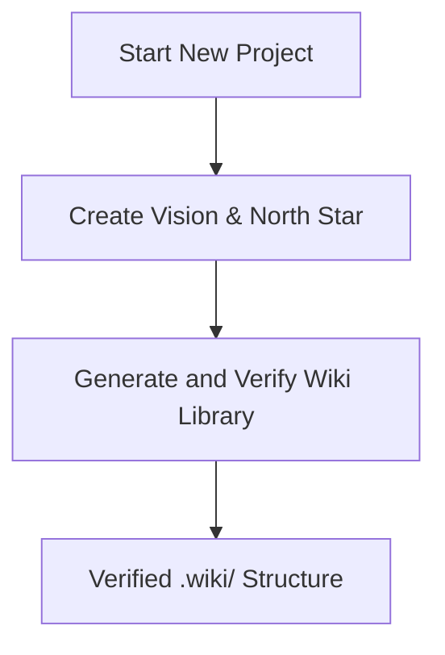
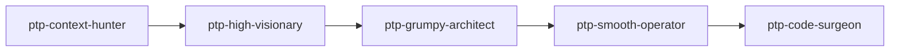
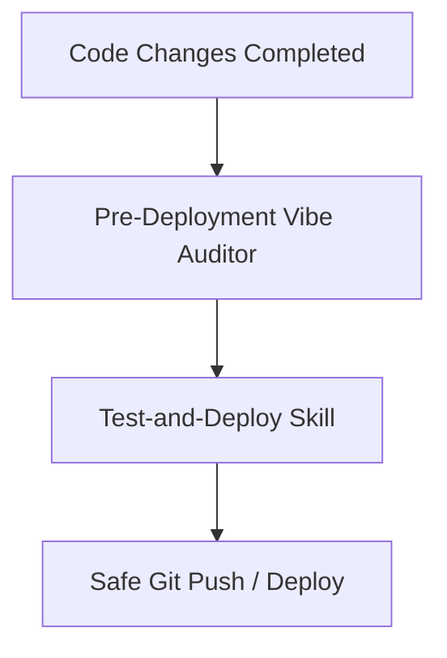

# How-To: Agentic Development & Documentation Lifecycle

Pass the Parcel is a template for stateless, multi-agent software delivery and a governed, agent-first wiki. This guide follows the lifecycle end to end: bootstrap a workspace, run the parcel pipeline, retain knowledge at wrap-up, validate before deploy, and sync the portable machinery into a satellite.

---

## 1. Bootstrapping & Core Setup

Every new project starts by aligning on the product context, then building the documentation base.



### Phase A: Vision & North Star
*   **Purpose:** Turns the codebase and requirements into a strategic roadmap (`01-vision-north-star.md`), aligning product objectives with engineering tasks and defining the constraints.
*   **Note:** this phase was previously assisted by a product/strategy authoring skill, retired in T1-E4.01 as having no operational home. The roadmap artefacts and this phase remain; author them directly.

### Phase B: Generate & Verify the Wiki Library
*   **Skills:** `@wiki-generate`, then `@wiki-bootstrap`
*   **Purpose:** `@wiki-generate` drafts the `.wiki/` structure — folder taxonomy, index rows, and doc skeletons — from the codebase. `@wiki-bootstrap` then verifies each doc against reality, one doc at a time. Generated docs stay `in-progress` until a human promotes them to `stable`.

---

## 2. The Parcel Pipeline

Every multi-step task runs through the same stateless parcel pipeline: a single markdown plan file (`.devops/plans/[code]-[slug]-plan.md`) carries all state. In the default `MULTI` topology each phase group is executed by one specialized sub-agent that reads the plan, does its job, updates the plan, and exits; in `SINGLE` topology (fast plan) the orchestrator plays those personas inline — see [§ Agent Topology](#agent-topology).



1.  **`ptp-context-hunter`** — Group A (Phases 1-3): expands intent, runs the Context Inventory (wiki docs + knowledge capture + source), resolves ambiguity via interactive Phase 3 questioning, halts at Gate A.
2.  **`ptp-phase3-answerer`** — Phase 3.5 (`AUTO` mode only): auto-resolves Phase 3 questions from the Research Map; any `Unresolvable:` entry falls back to asking the user.
3.  **`ptp-high-visionary`** — Group B (Phases 4-5): writes the wiki requirements spec + acceptance criteria, then the implementation plan (Simplicity Ladder; no code snippets except exact string literals), halts at Gate B. Also owns `PHASE_5_REVISION` fix rounds.
4.  **`ptp-grumpy-architect`** — Phase 6: **Spec & Logic Audit** of the text-based architecture (the plan contains no code). Evaluates logical completeness, edge cases, file boundary collisions, dependency gaps, YAGNI bloat, performance trade-offs, security, and architectural anti-patterns. Rejection sets `PHASE_5_REVISION`.
5.  **`ptp-smooth-operator`** — Phase 7: product review of vision alignment, user journey, and scope containment. Rejection sets `PHASE_5_REVISION`.
6.  **`ptp-code-surgeon`** — Group D (Phases 8-9): **triggers only after the plan is approved** (Gate C in `MULTI`; Gate B in `SINGLE`). Executes the approved plan single-pass direct-to-disk (no intermediate Markdown code blocks), runs QA verification, halts at Gate D for user sign-off.

**Deterministic rejection loop (Gate C):** if Phase 6 or 7 fails review, the plan's status is set to `PHASE_5_REVISION` and returned to Group B (High-Visionary) before Gate C is re-evaluated. **An unapproved plan never advances to execution.**

**Gates:** A (Scope, after Phase 3) → B (Spec & Plan, after Phase 5) → C (Peer Reviews, after Phase 7) → D (Implementation, after Phase 9). The lifecycle states are canonical in the `@pass-the-parcel` skill.

### Mode Selection
Plans support two operational modes:
- **`USER-MANAGED`** *(default)* — the orchestrator halts at every gate (A, B, C, D) for explicit user approval.
- **`AUTO`** — Gates A-C auto-clear **only** on positive, presence-based evidence (`.devops/rules/plan-lifecycle.md` § AUTO Gate Evidence Contract); **Gate D always halts for the human**. Hard halts still fire for destructive actions, build failures, and unresolvable blockers.

### Agent Topology
Independently of the mode, a plan runs in one of two topologies — chosen by **task complexity** (blast radius, contract change, risk, ambiguity, novelty) and confirmed by the user at plan start:
- **`MULTI`** *(default — comprehensive plan)* — the orchestrator delegates each phase group to its `ptp-*` sub-agent; Group C runs as independent, context-isolated reviewers; 4 gates (A-D).
- **`SINGLE`** *(fast plan)* — the orchestrator executes each group's persona inline (no sub-agent spawns); Group C is skipped and Gates B+C merge into one approval at Gate B (Gate C `N/A`); cheapest for local, low-risk changes.

Gate D always halts for the human in both topologies (`AUTO` auto-clears Gates A-C only on positive evidence — see `.devops/rules/plan-lifecycle.md` § AUTO Gate Evidence Contract). Record the choice in the plan's **Plan Settings** block at the **TOP** of the plan file (frozen config — never the bottom State & Gates). Full contract: `@pass-the-parcel` § Agent Topology.

#### Parcel-Fast (subagent-only fast lane)
**Parcel Fast is no longer a selectable agent.** The fast lane — `Mode = AUTO` + `Agents = SINGLE` — is reachable two ways and no more: **unattended** through the batch host (`parcel-sprint` → `ptp-parcel-fast`, one fresh context per plan), and **interactive** through `parcel` with `AUTO`/`SINGLE` selected at plan start (there is no `/parcel-fast` shortcut). `AUTO` auto-clears Gates A-C only on positive evidence — see `.devops/rules/plan-lifecycle.md` § AUTO Gate Evidence Contract; only Gate D halts for the human. Presets are declared in the `## Orchestrator Presets` table of `.opencode/plans/base-context.md`.

#### Sprint Batch Runner (`@sprint-run`)
When a sprint is open and its queue is committed, `@sprint-run` (host agent `parcel-sprint`) runs the whole eligible queue in one unattended pass. That predicate is **executed, not reasoned**: `python scripts/sprint_eligible.py` (workspace root) prints the eligible set, claim order, parallel groups and per-plan skip reasons as JSON, and the host acts only on that output — exit `0` means computed, a non-zero exit halts the batch and is never replaced by prose. Eligibility is re-evaluated **immediately before each claim** and re-applied to the remaining queue until nothing is eligible — a **fixpoint loop**, bounded by the queue length, ordered by the queue (never topologically sorted), and cycle-safe (a mutual `depends_on` terminates the loop and flags a queue defect). The predicate's two clauses are independent: (1) every `depends_on` code is **satisfied** — present in `.devops/archive/` **or** present in `.devops/plans/` with `claim_status: GATE_D_USER_APPROVAL` (executed through Phase 9, Gate D `OPEN`, awaiting the verdict); anything else — still `QUEUED`, or `CLAIMED` below `PHASE_9` — is unmet; (2) no `touches` overlap with any plan in `.devops/plans/`, including plans already batched to `PHASE_9`. A satisfied dependency does **not** clear clause 2: an executed-but-unverified dependency still holds its files until it is archived. A preflight **dependency-cycle check** and a **resolution forecast** (the expected claim order + terminal skip set) are presented with the informed **run preview** (eligible plans, skip list with reasons, orphan re-adoptions, a blast radius), all labelled a **forecast**; then for each plan the runner claims it on the trunk and spawns one `ptp-parcel-fast` subagent (locked `AUTO` + `SINGLE`, one fresh context per plan, Phases 1→9). Plans terminate at `PHASE_9` with `claim_status: GATE_D_USER_APPROVAL` and **Gate D `OPEN`**; the batch emits one consolidated report and one human verdict covers the whole batch — Gate D is deferred, never skipped. **Retirement is a separate, operator-invoked step:** the batch never wraps itself up. After the verdict, one distinct invocation of `@agent-wrap-up` in its **batch scope** covers the whole set — it asserts each plan's confirmation gate (bottom `Status: PHASE_9`, `claim_status: GATE_D_USER_APPROVAL`, a `DONE` outcome, Phase 9 evidence plus acceptance criteria, and the exact `plan: <code>` commit), runs the repo gates once, then sets `COMPLETE` and archives each plan. A plan failing any assertion is **carry-forward**, never complete; per-plan `@agent-wrap-up` remains valid and composes. Three deviations from the default protocol apply: **batched Gate D**, **retirement as a separate, operator-invoked step**, and the **Strict Context Isolation** exception. Hard failures stop the line immediately and emit a partial report. Before the first claim, the host also surfaces every plan its computed `complexity` flag marks **MULTI-worthy** — a plan whose commit-time `triage` recommends `MULTI`, or whose declared `touches` exceed the triage table's blast-radius bound (`<= 3 files, one domain`; `@pass-the-parcel` Agent Topology) — for one operator answer: **accept batch risk** (the locked `AUTO` + `SINGLE` run, so no independent reviewer) or **defer to manual**. A deferral is a **pure pause at that plan's slot** — the loop never claims past it — reported as `DEFERRED-MANUAL` with the dependents it strands and the resume path (deliver the plan via `@pass-the-parcel` in `MULTI`, then re-invoke `@sprint-run`). That yield is a **halt**, not a fifth deviation: canonical semantics live in `.devops/rules/plan-lifecycle.md` Claim Protocol, section Multi-worthy Yield. Full contract: `.devops/rules/plan-lifecycle.md` § Deviations and the `sprint-run` skill.

**Lanes, and who owns the counter.** The same JSON carries an advisory **lane** classification (`lanes` + `reserved_surfaces`): a plan whose `touches` hits a *reserved surface* — the `machinery-version` counter and its `version-history.md` row, the prefix lock (`base-context.md`, its seed, `.devops/agents/**`), the changelog, and the sprint/backlog registers — or whose skill edit triggers the prefix-embed cascade, is on the **serial** lane. The definition, stated once, is `.devops/rules/plan-lifecycle.md` § Claim Protocol → *Reserved Surfaces & the Lane Model*. A lane is a **classification, not a promise**: every path runs in place serially, so it executes both lanes serially and an empty lane B is the normal case in this template. Alongside it, `machinery-version` has **one writer per batch** — the follow-up batch wrap-up (`@agent-wrap-up` § Batch Scope), reading the live value at that moment; a plan runner never bumps it, because N runners reading one shared base is exactly the collision that made six Sprint 9 waves hand-reconcile a stale counter.

---

## 3. Knowledge Retention & Wrap-Up

As implementation concludes, the agent must document what it learned and clean up the workspace logs.

*   **Agent Changelog** (`.devops/logs/agent-changelog.md`): A running chronological journal of agent actions, changes, and state.
*   **`@knowledge-consolidation`**: Periodically structures, de-duplicates, and archives local developer knowledge into indexed snippets.
*   **`@agent-wrap-up`**: Runs final workspace state synchronization. It reviews modified files, updates logs, archives the plan, and closes the active loop.
*   **`@spaghetti-monster`**: Scans for high-complexity code regions and packages them into backlog parcel plans for later refactoring.
*   **`@sprint-close`**: Closes the committed sprint: retro into `sprint.md`, the hygiene scan, a one-by-one user-acceptance walk of the sprint's manual tests with the operator (`user-testing.md`, recorded with the sprint record), and a plain-language business report for business stakeholders, filed with the archived sprint record.

---

## 4. Pre-Deployment Validation

Before any code is pushed to production or committed to the remote repository, it must pass a strict security and quality gateway:



*   **`@test-and-deploy` § *App-facing hardening sweep***: Scans the codebase for "vibe-coded" anomalies, architectural drift, unoptimized queries, missing error handling, or security risks. (This check absorbed the previously separate pre-deployment auditor in T1-E4.01.)
*   **`@test-and-deploy`**: Automates running the local test suite, executing linter rules, and verifying configurations before executing a safe, pre-validated git push or deployment.

---

## 5. Additional Utility Skills

| Skill | Theme | Purpose |
|---|---|---|
| `@wiki-query` | Wiki | Read-only lookup and synthesis from wiki docs |
| `@wiki-lint` | Wiki | Check wiki health, detect broken links, index drift |
| `@wiki-generate` | Wiki | Draft index rows and doc skeletons from the codebase (structure) + ingest an `openwiki/` OKF bundle |
| `@wiki-update` | Wiki | Refresh only the docs a `git diff` invalidated; stamp `last-reviewed` |
| `@wiki-bootstrap` | Wiki | Verification pass over the wiki, one doc at a time (v2) |
| `@design-audit` | Quality | Audit UI compliance against the design system |
| `@karpathy-guidelines` | Quality | Code writing and review best practices |
| `@ui-inventory-scanner` | Quality | Scan and catalogue UI elements |
| `@frontend-design` | Quality | Build production-grade frontend interfaces |
| `@backlog` | Product | Create and manage backlog items |
| `@build-roadmap` | Product | Create a product roadmap with themes and epics |
| `@true-or-false` | Product | Validate requirements against codebase reality |
| `@knowledge-capture` | Knowledge | Record tribal knowledge and decisions |
| `@skill-creator` | Knowledge | Create and iterate on new agent skills |
| `@sync-architecture` | Machinery | Pull template machinery updates into a satellite workspace |

---

## 6. Syncing Machinery into a Satellite Workspace

This repo is the **template**; any other workspace is a **satellite** that consumes the portable surface (`.devops/skills/`, `.devops/agents/`, rule layers, `.devops/templates/`, `.vscode/`, sync scripts).

### One-time bootstrap (push)
A satellite has no pull script yet, so first contact goes through the template's push engine:

```powershell
powershell -NoProfile -File <template>\scripts\sync-architecture.ps1 -Target <satellite>
# or from git: clone to %TEMP%\ptp and run the same command from there
```

Then author the three repo-specific files from the seeds in `.devops/templates/` (`AGENTS.md`, `opencode.json`, `.opencode/plans/base-context.md`) — see `.devops/templates/SATELLITE-BOOTSTRAP.md` for the full checklist.

> **Binding note (opencode.json).** The `agent` block is **required** — a missing or empty block fails `check-parcel-prefix.ps1`. **No agent entry declares a `model`**: every agent inherits the model selected in the CLI / picker, and the operator chooses subagent models at run time. `@sync-architecture` **strips** any model it finds rather than stamping one (see `.devops/skills/model-routing/SKILL.md` §3).

### Ongoing pulls
Record the source once — `scripts\pull-architecture.ps1 -Source <path-or-git-url>` writes `.ptp-source` — then say "sync architecture" (`@sync-architecture`) or run `scripts\pull-architecture.ps1`. Add `-Check` for a read-only drift report with per-item verdicts:

| Verdict | Meaning |
|---|---|
| `CURRENT` | identical |
| `UPGRADE` | newer version upstream — safe to pull |
| `DRIFT` | same version, different bytes — locally customized, diff before overwriting |
| `MISSING` | never installed here — a sync will create it |
| `SOURCE-ABSENT` | manifest lists it but the template lacks it — manifest bug |
| `PRUNE` | listed in `prune_files` and present in the target — a sync will delete it (counts as out of sync) |

`-Check` exits `1` (`OUT OF SYNC`) when any of `UPGRADE`/`DRIFT`/`MISSING`/`SOURCE-ABSENT`/`PRUNE` is present; a retired file reports `PRUNE`, not a parent-directory `DRIFT`.

### Versioning
Each skill carries an integer `version:` + `updated:` date in its frontmatter; `.devops/sync-manifest.yaml` carries one `machinery-version:` covering agents/rules/scripts/templates as a coordinated set. `@agent-wrap-up` owns the bump discipline: modify a portable file → bump its version (and `machinery-version` for non-skill surfaces) → satellites see `UPGRADE`, not `DRIFT`. In a **batch**, that discipline collapses to **one** `machinery-version:` increment for the whole batch, taken by the follow-up batch wrap-up from the value live at that moment — nested inside a batch, the per-plan path would have N writers reading one stale base (`.devops/rules/plan-lifecycle.md` § Claim Protocol → *Counter Ownership*).

### Model selection

The parcel pipeline routes by **capability class** — `orchestration`, `retrieval/inventory`, `retrieval/Q&A`, `deep planning/authoring`, `adversarial review`, `product review`, `execution`, `independent audit` — and prose never names a vendor model.

**No agent declares a model.** Every agent runs on the model selected in the CLI / picker. Where a run spawns subagents, the operator chooses at run time: **per gate** (A/B/C/D) for `parcel` in `MULTI`, or **one for the whole batch** under `@sprint-run`. The choice is recorded in the plan's frozen `Plan Settings.Models` row (or the batch report) and passed at spawn time only where the runtime supports it — VS Code does; opencode does not, and halts explicitly rather than substituting silently. The `## Model Registry` in `.opencode/plans/base-context.md` is a **capability-class reference** that guides the question; it is not a source of any model. Full procedure: `.devops/skills/model-routing/SKILL.md` §3.

`scripts/check-parcel-prefix.ps1` asserts the invariant by **absence** — a `model:` line in any agent frontmatter, an `agent.<key>.model` in `opencode.json` or its seed, or a registry row carrying more than two cells is a failure. `@sync-architecture` reconciles the capability-class rows into a satellite and **strips** any model it finds; it never stamps one. CI (`.github/workflows/validate.yml`) enforces the prefix, encoding, wiki, JSON, SelfTest, and coverage gates on every push **in this template repo**; a satellite wires the same gates into its own workflow (the checks ride in the synced `scripts/check-parcel-prefix.ps1`). `scripts/sync-architecture.ps1 -SelfTest` smoke-tests the transport engine — including the model-absence contract — on `ubuntu-latest`.

---

## 7. Wiki Evidence & Drift Automation

Docs may carry Grounded Claims (`claims:` frontmatter, `source: path#symbol` + a content hash). `scripts/wiki_claims.py check` fails CI when a claimed source changed; `affected` lists the docs a diff invalidated; `update` re-stamps; `coverage` runs the code-coverage gate. `@wiki-generate` drafts structure and `@wiki-update` refreshes incrementally. A secret-free scheduled job (`.github/workflows/wiki-refresh.yml`, weekly cron + manual dispatch) runs the claims checker and raises a `wiki-drift` issue when docs drift, closing it again once clean. (The OKF export/import bridge and the static visualizer were retired in T1-E4.01; CI keeps asserting that every `.wiki/**/*.md` frontmatter block parses as YAML.)

---

## See Also
- [OPERATING-PRINCIPLES.md](OPERATING-PRINCIPLES.md) — the goal and the instruments that serve it
- [README.md](README.md) — the product page and quickstart
- [AGENTS.md](AGENTS.md) — the agent entry point and task lookup
- [`.devops/README.md`](.devops/README.md) — operational state and the transportable machinery
