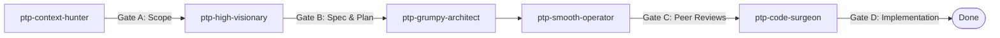

# Pass the Parcel

**Turn a feature request into a reviewed, executed, verified change — by passing one Markdown plan between specialised agents.**

[](https://github.com/CMC-27/pass-the-parcel/actions/workflows/validate.yml)

Pass the Parcel is a template for **stateless, multi-agent software delivery**. A single plan file (`.devops/plans/<slug>-plan.md`) holds all state; each phase is executed by one agent that reads the plan, does exactly one job, writes its result back, and exits. No agent carries a conversation, the reviewers never see the planner's reasoning, and every gate is a hard stop. Around the pipeline sits an **agent-first wiki** that acts as the source of truth for the codebase.

## Why this exists

Agentic coding tends to fail in predictable ways: the context window fills and the agent forgets the plan; the "reviewer" is just the same model agreeing with itself; and six weeks later nobody can reconstruct why a decision was made. Pass the Parcel fixes the structure, not the model:

- **One plan, zero carried context.** State lives in the plan, so every agent starts cold and cheap.
- **Independent review by construction.** Reviewers run in isolated contexts and cannot see the planner's chain of thought.
- **Hard gates, not vibes.** Scope, spec, review, and implementation each require an explicit verdict before the next group runs.
- **Docs before code.** The wiki requirement is written first and the code is built to meet it — wrap-up reconciles the two.

## The pipeline



The plan moves through ten phases in six groups. Groups A and B **plan**, Group C **reviews** (independently), Group D **executes and verifies**, Groups E and F handle **user review and wrap-up**. Gates A–D are hard stops: an unapproved plan never reaches execution. A `SINGLE` topology collapses the pipeline to one agent playing the personas inline for low-risk changes.

## What you get

| | Capability | Detail |
|---|---|---|
| 🧭 | **Stateless 10-phase pipeline** | Phases, gates, and lifecycle states are defined once and enforced across the skills and agents. |
| 🛑 | **Four hard gates** | A Scope → B Spec & Plan → C Peer Reviews → D Implementation. `AUTO` mode auto-clears A–C; **Gate D always waits for a human**. |
| 📚 | **Agent-first wiki** | Governance rules, a deterministic linter, and grounded claims keep the knowledge base honest as the code changes. |
| 🔒 | **Deterministic CI gates** | Prefix integrity, UTF-8, wiki lint, coverage, claims drift, and a transport self-test on every push. |
| 🚚 | **Portable machinery** | Skills, agents, rules, and scripts sync into any satellite workspace with per-item `CURRENT`/`UPGRADE`/`DRIFT` verdicts. |
| 🧰 | **A skill library** | Planning, review, wiki maintenance, backlog, sprints, audits, and design — all as plain `SKILL.md` packages. |

## Quickstart (5 minutes)

**Start from this template**

1. Click **Use this template** on GitHub, then clone your new repository.
2. Open it in your agent runtime of choice (VS Code with the custom agents, or the `opencode` runtime).
3. Bind your models — copy the seed from [`.devops/templates/opencode.template.json`](.devops/templates/opencode.template.json) and fill the placeholders, or edit `opencode.json` directly.
4. Ask your agent to run `/parcel <feature description>`. It walks Group A, halts at **Gate A**, and hands the scope back to you for approval.

**Add it to an existing repository**

Run the one-time bootstrap from the template, then author the three repo-specific files from the seeds. The full checklist — including the `VERIFIED` confirmation step — is in [`.devops/templates/SATELLITE-BOOTSTRAP.md`](.devops/templates/SATELLITE-BOOTSTRAP.md):

```powershell
git clone <this-repo-url> $env:TEMP\ptp
powershell -NoProfile -File $env:TEMP\ptp\scripts\sync-architecture.ps1 -Target .
```

**Keep it up to date**

```powershell
powershell -NoProfile -File scripts\pull-architecture.ps1 -Check   # read-only drift report
powershell -NoProfile -File scripts\pull-architecture.ps1          # pull updates
```

## Repository map

| Path | What it is |
|---|---|
| [`AGENTS.md`](AGENTS.md) | The authoritative entry point for agents — core rules and the task-lookup table. |
| [`HOW-TO.md`](HOW-TO.md) | The lifecycle guide: bootstrapping, the parcel pipeline, validation, and sync. |
| [`.wiki/`](.wiki/core/00-system-index.md) | The architecture knowledge base — vision, design system, state, features, testing. |
| [`.devops/`](.devops/) | Operational state and the transportable machinery: skills, agents, plans, backlog, archive, logs. |
| [`.opencode/plans/base-context.md`](.opencode/plans/base-context.md) | The PREFIX-LOCKED shared prefix inlined into every agent. |
| `scripts/` | The deterministic gates and the sync/transport engine. |
| [`docs/`](docs/wiki-graph.md) | Generated wiki graph + catalog (written by `scripts/wiki_visualize.py`, not authored). |

## See a real run

[`.wiki/examples/parcel-walkthrough-machinery-hardening.md`](.wiki/examples/parcel-walkthrough-machinery-hardening.md) walks a complete parcel end to end — including a reviewer rejection, a revision loop, and the final verification — using the archived T1-E2.01 run as the transcript.

## Go deeper

- **Contributing:** [`CONTRIBUTING.md`](CONTRIBUTING.md) · [`CODE_OF_CONDUCT.md`](CODE_OF_CONDUCT.md) · [`SECURITY.md`](SECURITY.md)
- **Releases:** [`CHANGELOG.md`](CHANGELOG.md) · [`.devops/logs/version-history.md`](.devops/logs/version-history.md)
- **Licence:** [`LICENSE`](LICENSE) (MIT)

## Licence

MIT — see [`LICENSE`](LICENSE).
