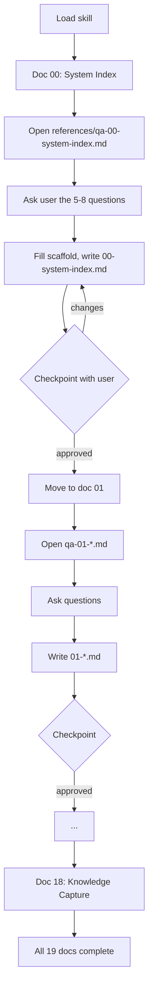

---
type: "core"
name: "wiki-bootstrap"
status: "stable"
description: "Bootstraps the wiki by walking each of the 19 core docs one by one, asking 5-8 targeted questions per doc to elicit correct content. The wiki is the brain of the app — AI agents rely on it to make the right coding decisions."
references: "references/0X-*.md — 19 scaffold templates (one per core doc) to copy as starting points. references/qa-0X-*.md — 19 question sets (one per doc) to drive the per-doc Q&A workflow."
---

# wiki-bootstrap

This skill bootstraps a project's documentation library by walking through each of the 19 core wiki docs **one at a time** and asking the user 5–8 targeted questions per doc to fill it in correctly.

> **CRITICAL**
> **The wiki is the brain of the app.** Every AI coding agent reads it before making decisions — what to build, where to put it, what tokens to use, which rules apply. If the wiki is wrong, the agent is wrong. Outdated or vague content is technical debt that compounds with every PR.

This skill exists to ensure that when a new doc is born, it is born correct.

---

## 1. Core Philosophy

| Principle | Meaning |
| :--- | :--- |
| **Agent-First Knowledge** | The doc is written so the next agent (or human) can act on it without re-deriving context. |
| **Correctness over Completeness** | A half-finished but accurate doc is more valuable than a sprawling but wrong one. |
| **Per-Doc Attention** | Each of the 19 core docs gets undivided attention. No bulk fills, no assumed content. |
| **One Question Set Per Doc** | 5–8 questions, tailored to what an agent will need to decide based on that doc. |

---

## 2. Folder Taxonomy (Reference)

The wiki library is organized into two top-level structures:

| Directory | Role | Index File |
| :--- | :--- | :--- |
| `wiki/core/` | **The Brain** — 19 numbered docs covering the foundations | `00-system-index.md` |
| `wiki/features/` | **The Nervous System** — per-feature docs (`feat-*.md`) | `features-index.md` |
| `wiki/components/` | **The Muscle** — reusable UI atoms/molecules/organisms | `components-index.md` |
| `wiki/database/` | **The Skeleton** — schema breakdowns | `database-index.md` |
| `wiki/logic/` | **The Internal Organs** — utilities, hooks, services, engines | `logic-index.md` |

Operational tooling lives in `docs/`: `docs/{backlog,logs,plans,archive-plans}/`.

> **Note:** Your project may nest these under `docs/` (e.g., `docs/wiki/`). The internal structure stays consistent.

---

## 3. Naming Conventions (Reference)

| Directory | Prefix Pattern | Examples |
| :--- | :--- | :--- |
| `wiki/core/` | `0x-name.md` | `00-system-index.md`, `01-vision-north-star.md` |
| `wiki/features/` | `feat-feature-name.md` | `feat-dashboard.md` |
| `wiki/components/` | `ui-component-name.md` | `ui-modal.md` |
| `wiki/database/` | `db-collection-name.md` | `db-projects.md` |
| `wiki/logic/` | `util-name.md` or `hook-name.md` | `util-date-parser.md` |

---

## 4. Standard Document Anatomy (Reference)

Every `.md` file should follow this shape:

```yaml
---
type: "core" | "feature" | "component" | "database" | "logic"
name: "Human Readable Name"
status: "stable" | "in-progress" | "deprecated"
dependencies: ["feat-auth", "db-projects"]
db_relations: ["projects", "assemblies"]
description: "Brief summary of the document's purpose."
---
```

Then: H1 → 2–3 sentence overview → Technical Context (paths, data shapes, Mermaid) → Relationships (cross-links) → Rules & Constraints (if any).

---

## 5. The Bootstrap Loop (Core Workflow)

This is the **only** way this skill operates. Do not bulk-fill. Do not skip docs.



### For each of the 19 core docs (`00` → `18`):

1. **Open the question set** at `references/qa-0X-name.md` for the current slot.
2. **Copy the scaffold** from `references/0X-name.md` into `docs/wiki/core/0X-name.md` as a starting point.
3. **Ask the user** the 5–8 questions from the Q&A file. Use the `question` tool to batch them, OR ask one-by-one if the user prefers. Each question is designed to surface a specific kind of correctness risk.
4. **Fill in the scaffold** using the user's answers. Where an answer is "I don't know" or unclear, write a `[PLACEHOLDER: <reason>]` and flag it to the user — never invent content.
5. **Checkpoint with the user** before moving to the next doc. Show the drafted content, confirm accuracy, and only then proceed.
6. **Repeat** for the next slot in `00` → `18` order.

> **DO NOT** skip a doc because it seems unimportant. Slot `00` (the hub) depends on slots `01`–`18` existing; that's why we go in order — each doc builds on the previous.
>
> **DO NOT** ask all 19 docs' questions at once. The user needs to focus on one slot at a time.
>
> **DO NOT** silently fill in placeholders. If the user doesn't know the answer, the doc should explicitly say so — that's a gap, not a default.

---

## 6. Question Set Reference Table

When you reach slot `0X`, open this file to read its question set:

| Slot | Doc | Question Set |
| :--- | :--- | :--- |
| 00 | System Index (The Hub) | `references/qa-00-system-index.md` |
| 01 | Vision & North Star | `references/qa-01-vision-north-star.md` |
| 02 | Product Context | `references/qa-02-product-context.md` |
| 03 | User Journey | `references/qa-03-user-journey.md` |
| 04 | Core Architecture | `references/qa-04-core-architecture.md` |
| 05 | Design System | `references/qa-05-design-system.md` |
| 06 | Directory Structure | `references/qa-06-directory-structure.md` |
| 07 | App Structure | `references/qa-07-app-structure.md` |
| 08 | State & Context | `references/qa-08-state-context.md` |
| 09 | AI Features | `references/qa-09-ai-features.md` |
| 10 | External Integrations | `references/qa-10-external-integrations.md` |
| 11 | Validation Standards | `references/qa-11-validation-standards.md` |
| 12 | Utility Standards | `references/qa-12-utility-standards.md` |
| 13 | Security Standards | `references/qa-13-security-standards.md` |
| 14 | Performance Standards | `references/qa-14-performance-standards.md` |
| 15 | Theme & Linguistics | `references/qa-15-theme-linguistics.md` |
| 16 | Glossary of Terms | `references/qa-16-glossary-of-terms.md` |
| 17 | Docs Blueprint | `references/qa-17-docs-blueprint.md` |
| 18 | Knowledge Capture | `references/qa-18-knowledge-capture.md` |

Each Q&A file follows this shape:

- **Why this doc matters to AI agents** — what decisions the next agent will make from this doc.
- **Required sections** — the must-have structure for the doc.
- **Questions to ask** — 5–8 targeted questions, in order.
- **Sources of truth** — code paths, configs, or external systems to verify against if the user is unsure.

---

## 7. Scaffold Templates (Reference)

The 19 scaffold files at `references/0X-name.md` (one per slot) contain the correct YAML frontmatter, section headings, structural patterns, and inline `[PLACEHOLDER]` markers. **Always copy the relevant scaffold into `docs/wiki/core/0X-name.md` first** — do not write the doc from scratch. The scaffold ensures every doc has the same anatomy, so agents know where to look for what.

---

## 8. Foundation Checklist (One-Liner Per Slot)

For full slot definitions, see the Q&A files above and the scaffold templates. One-line purpose per slot:

| Slot | Purpose |
| :--- | :--- |
| 00 | Master hub with data-flow diagram and links to all indices. |
| 01 | Vision statement, north star metric, magic moment. |
| 02 | Personas, core use cases, roadmap summary, glossary link. |
| 03 | Onboarding path, primary happy path, secondary flows, error recovery. |
| 04 | Data lifecycle, engines, derivations, guardrails. |
| 05 | Color tokens, typography, spacing, form styles, interactive states. |
| 06 | Root layout, `src/` tree, naming rules. |
| 07 | Entry point, router, layout wrappers, nav architecture. |
| 08 | Provider tree, context shapes, hook APIs, persistence. |
| 09 | In-app AI features, prompts, response schemas, fallbacks. |
| 10 | Integration endpoints, field mappings, auth, export/import. |
| 11 | Validation tiers, error classification, error dashboard UX. |
| 12 | Rounding, formatters, ID generation, visual micro-patterns. |
| 13 | Security boundaries, RLS, secret management, rate limits. |
| 14 | Bundle architecture, lazy-loading, performance budgets. |
| 15 | Nomenclature mappings, translation key registry. |
| 16 | App terms, design token semantics, domain terminology, abbreviations. |
| 17 | Concise pointer to the `wiki-bootstrap` skill itself. |
| 18 | Decision log: date, context, decision, rationale, impact. |

---

## 9. When to Use This Skill

- **Setting up a brand-new project's wiki** (cold start).
- **Filling in a previously-stubbed slot** in an existing wiki.
- **Re-bootstrapping a doc** that's known to be wrong or stale (paired with `wiki-assessment` for verification).

For ongoing audits, drift detection, and gap-finding on an existing wiki, use the companion skill: **`wiki-assessment`**.

---

> **The Golden Rule**
> If a feature's behavior changes in code, the documentation **MUST** be updated in the same PR/Conversation. Outdated documentation is technical debt that misleads every AI agent that reads it next.
