# Wiki Graph

> Generated by `scripts/wiki_visualize.py` — do not edit by hand.
> Regenerate: `python scripts/wiki_visualize.py`

## Hub & Spoke

```mermaid
flowchart TD
  N_core_00_system_index_md["System Index (hub)"]
  N_core_01_vision_north_star_md["🌟 Vision & North Star"]
  N_core_00_system_index_md --> N_core_01_vision_north_star_md
  N_core_02_product_context_md["Product Requirements & Context"]
  N_core_00_system_index_md --> N_core_02_product_context_md
  N_core_03_glossary_of_terms_md["📖 Glossary of Terms"]
  N_core_00_system_index_md --> N_core_03_glossary_of_terms_md
  N_core_04_state_context_md["State & Context Data Shapes"]
  N_core_00_system_index_md --> N_core_04_state_context_md
  N_core_05_core_architecture_md["Core Architecture Concepts"]
  N_core_00_system_index_md --> N_core_05_core_architecture_md
  N_core_06_directory_structure_md["Physical Directory Structure"]
  N_core_00_system_index_md --> N_core_06_directory_structure_md
  N_core_07_app_structure_md["Application Shell Architecture"]
  N_core_00_system_index_md --> N_core_07_app_structure_md
  N_core_08_user_journey_md["User Journey & Data Hierarchy"]
  N_core_00_system_index_md --> N_core_08_user_journey_md
  N_core_09_design_system_md["Design System: Architectural Precision & Technical Blueprint Clarity"]
  N_core_00_system_index_md --> N_core_09_design_system_md
  N_core_10_validation_standards_md["Validation Standards"]
  N_core_00_system_index_md --> N_core_10_validation_standards_md
  N_core_11_utility_standards_md["🧮 Utility Standards"]
  N_core_00_system_index_md --> N_core_11_utility_standards_md
  N_core_12_security_standards_md["Security Standards: Core Security Principles for Agentic Development"]
  N_core_00_system_index_md --> N_core_12_security_standards_md
  N_core_13_performance_standards_md["⚡ Performance Standards"]
  N_core_00_system_index_md --> N_core_13_performance_standards_md
  N_core_14_testing_standards_md["Testing Standards"]
  N_core_00_system_index_md --> N_core_14_testing_standards_md
  N_core_15_ai_features_md["AI Integration & Agentic Workflows"]
  N_core_00_system_index_md --> N_core_15_ai_features_md
  N_core_16_external_integrations_md["External Integrations"]
  N_core_00_system_index_md --> N_core_16_external_integrations_md
  N_core_17_docs_blueprint_md["🗺️ @docs Architecture Blueprint"]
  N_core_00_system_index_md --> N_core_17_docs_blueprint_md
  N_core_18_knowledge_capture_md["Knowledge Capture & Decision Log 🧠"]
  N_core_00_system_index_md --> N_core_18_knowledge_capture_md
  N_components_components_index_md["Components Index"]
  N_core_00_system_index_md --> N_components_components_index_md
  N_conventions_conventions_index_md["Conventions Index"]
  N_core_00_system_index_md --> N_conventions_conventions_index_md
  N_database_database_index_md["Database Index"]
  N_core_00_system_index_md --> N_database_database_index_md
  N_examples_examples_index_md["Examples Index"]
  N_core_00_system_index_md --> N_examples_examples_index_md
  N_features_features_index_md["Features Index"]
  N_core_00_system_index_md --> N_features_features_index_md
  N_hooks_hooks_index_md["Hooks Index"]
  N_core_00_system_index_md --> N_hooks_hooks_index_md
  N_integrations_integrations_index_md["Integrations Index"]
  N_core_00_system_index_md --> N_integrations_integrations_index_md
  N_logic_logic_index_md["Logic & Utilities Index"]
  N_core_00_system_index_md --> N_logic_logic_index_md
  N_ref_ref_index_md["Reference Index"]
  N_core_00_system_index_md --> N_ref_ref_index_md
  N_testing_testing_index_md["Testing Index"]
  N_core_00_system_index_md --> N_testing_testing_index_md
```

## Catalog

| Doc | Type | Description |
|---|---|---|
| [Components Index](../.wiki/components/components-index.md) | components | Catalog of all reusable UI components in the design system. |
| [Component Naming Conventions](../.wiki/conventions/conv-component-naming.md) | convention | React component naming patterns and conventions. |
| [CSS Class Naming Conventions](../.wiki/conventions/conv-css-classes.md) | convention | CSS class naming and organization standards. |
| [Database Naming Conventions](../.wiki/conventions/conv-database-naming.md) | convention | Table, column, and index naming conventions. |
| [Directory Naming Conventions](../.wiki/conventions/conv-directory-naming.md) | convention | Folder and directory naming standards. |
| [File Naming Conventions](../.wiki/conventions/conv-file-naming.md) | convention | File naming conventions across the codebase. |
| [JavaScript Naming Conventions](../.wiki/conventions/conv-js-naming.md) | convention | Naming conventions for JavaScript and TypeScript code. |
| [Test File Naming Conventions](../.wiki/conventions/conv-test-naming.md) | convention | Test file and test case naming conventions. |
| [Wording & Grammar Naming Conventions](../.wiki/conventions/conv-wording-naming.md) | convention | Standards for UI labels, error messages, and domain terminology. |
| [Conventions Index](../.wiki/conventions/conventions-index.md) | conventions | Hub for all naming and coding conventions across the codebase. |
| [System Index](../.wiki/core/00-system-index.md) | core | Master gateway - the hub in a hub-and-spoke documentation architecture |
| [🌟 Vision & North Star](../.wiki/core/01-vision-north-star.md) | core | The high-level strategic vision, guiding principles, and North Star for the application. |
| [Product Requirements & Context](../.wiki/core/02-product-context.md) | core | Executive summary, user personas, core hierarchy, and success metrics for the application. |
| [📖 Glossary of Terms](../.wiki/core/03-glossary-of-terms.md) | core | A definitive reference for business logic terms, technical hierarchy, UI concepts, and domain abbreviations. |
| [State & Context Data Shapes](../.wiki/core/04-state-context.md) | core | Defines global state shapes, context provider APIs, and persistence strategies. |
| [Core Architecture Concepts](../.wiki/core/05-core-architecture.md) | core | Key architectural decisions, core engines, technical guardrails, and data management strategies. |
| [Physical Directory Structure](../.wiki/core/06-directory-structure.md) | core | Physical source directory layout, mapping folders to their functional purpose. |
| [Application Shell Architecture](../.wiki/core/07-app-structure.md) | core | The outermost application shell — router, layout wrappers, context mounting, and navigation architecture. |
| [User Journey & Data Hierarchy](../.wiki/core/08-user-journey.md) | core | End-to-end user journey across all roles, with the definitive data hierarchy reference. |
| [Design System: Architectural Precision & Technical Blueprint Clarity](../.wiki/core/09-design-system.md) | core | The single source of truth for visual design decisions: tokens, typography, components, and interaction states. |
| [Validation Standards](../.wiki/core/10-validation-standards.md) | core | Core validation engine specification, data integrity tiers, and finalization guardrails. |
| [🧮 Utility Standards](../.wiki/core/11-utility-standards.md) | core | Architectural guardrails for deterministic mathematical calculations, floating-point safety, rounding precision, and data formatting. |
| [Security Standards: Core Security Principles for Agentic Development](../.wiki/core/12-security-standards.md) | core | Core security boundary definitions, data isolation, role-based access, agentic governance, and row-level policies. |
| [⚡ Performance Standards](../.wiki/core/13-performance-standards.md) | core | Architectural guardrails for maintaining a 95+ Lighthouse Performance Score, passing Core Web Vitals, and ensuring a frictionless user experience. |
| [Testing Standards](../.wiki/core/14-testing-standards.md) | core | Gateway to the testing documentation subtree. Defines test patterns, mocking standards, performance budgets, and PR checklist. |
| [AI Integration & Agentic Workflows](../.wiki/core/15-ai-features.md) | core | Documents the in-app AI capabilities, model integrations, prompt architectures, and human-in-the-loop patterns. |
| [External Integrations](../.wiki/core/16-external-integrations.md) | core | Documents all external data exchange points, field mapping tables, import/export specs, and integration protocols. |
| [🗺️ @docs Architecture Blueprint](../.wiki/core/17-docs-blueprint.md) | core | The universal blueprint for the @docs library architecture, establishing patterns for folder structures, naming conventions, and cross-linking strategies. |
| [Knowledge Capture & Decision Log 🧠](../.wiki/core/18-knowledge-capture.md) | core | Canonical log of core engineering decisions, tribal knowledge, and architectural strategies. |
| [Database Index](../.wiki/database/database-index.md) | database | Catalog of all database schema documentation. |
| [Examples Index](../.wiki/examples/examples-index.md) | examples | Catalog of worked examples demonstrating wiki conventions. |
| [Features Index](../.wiki/features/features-index.md) | features | Catalog of all application views, screens, and feature workflows. |
| [Hooks Index](../.wiki/hooks/hooks-index.md) | hooks | Catalog of custom React hooks and their wiki docs. |
| [AI Provider Integration (Example)](../.wiki/integrations/ai-provider-integration.md) | integration | Provider-neutral example of an LLM/AI model integration pattern. |
| [Integrations Index](../.wiki/integrations/integrations-index.md) | integrations | Catalog of external service and API integrations. |
| [Logic & Utilities Index](../.wiki/logic/logic-index.md) | logic | Catalog of all utility functions, custom hooks, and core logic. |
| [Reference Index](../.wiki/ref/ref-index.md) | ref | Catalog of external reference materials linked from wiki docs. |
| [Grounded Claims](../.wiki/rules/claims.md) | rule | — |
| [Content-vs-State Principle](../.wiki/rules/company-scoping.md) | rule | — |
| [Document Structure Pattern](../.wiki/rules/document-structure.md) | rule | — |
| [Frontmatter Standard](../.wiki/rules/frontmatter.md) | rule | — |
| [AI Rules](../.wiki/rules/language/ai-rules.md) | rule | — |
| [Communication Rules](../.wiki/rules/language/communication-rules.md) | rule | — |
| [Human Rules](../.wiki/rules/language/human-rules.md) | rule | — |
| [Prohibited Language](../.wiki/rules/language/prohibited-language.md) | rule | — |
| [Voice & Tone](../.wiki/rules/language/voice-and-tone.md) | rule | — |
| [Link Hygiene](../.wiki/rules/link-hygiene.md) | rule | — |
| [Naming Conventions](../.wiki/rules/naming.md) | rule | — |
| [Numbering Scheme](../.wiki/rules/numbering.md) | rule | — |
| [Structure Manifest](../.wiki/rules/structure.md) | rule | — |
| [Test Authoring Checklist](../.wiki/testing/checklist.md) | testing | PR review checklist for test file compliance. |
| [Mocking Standards](../.wiki/testing/mocking.md) | testing | Shared mock conventions and setup for tests. |
| [Testing Pattern](../.wiki/testing/pattern.md) | testing | Canonical test patterns for the project. |
| [Test Performance Budget](../.wiki/testing/performance.md) | testing | Per-file test performance budgets and hard limits. |
| [Testing Index](../.wiki/testing/testing-index.md) | testing | Hub for all test architecture documentation. |
